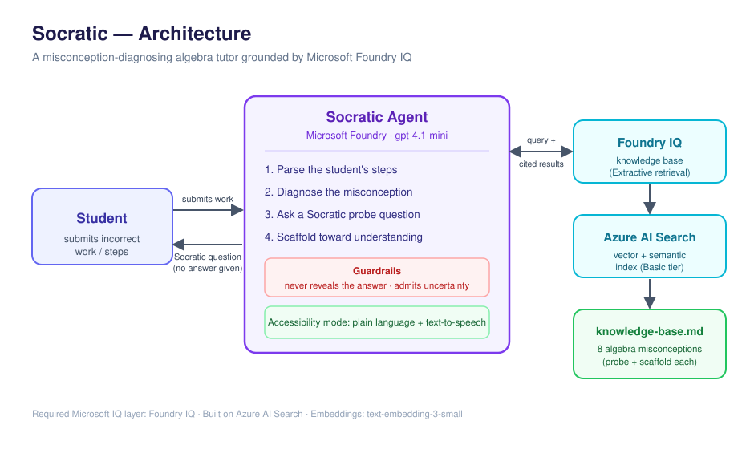

# Socratic — A Misconception-Diagnosing Algebra Tutor

> Most AI tutors just hand over the answer. **Socratic** figures out *why* a student got a problem wrong — the specific misconception behind the mistake — and guides them out of it with questions, never answers.

Built for the **Microsoft Agents League Hackathon** · Reasoning Agents track · grounded with **Foundry IQ**.

---

## The problem

Most AI homework helpers give the final answer, which short-circuits learning. The genuinely valuable thing is diagnosing the *misconception* behind a wrong answer and teaching the student past it. That is what Socratic does.

## What it does

When a student submits incorrect work, the agent:

1. **Parses the student's steps** — not just the final answer — to find where it first goes wrong.
2. **Diagnoses the misconception** by retrieving the best-matching entry from a knowledge base via **Foundry IQ**.
3. **Asks a Socratic probe question** that helps the student notice the issue themselves.
4. **Scaffolds** with a smaller sub-question so the student discovers the correct rule.
5. **Confirms** by having the student restate the corrected step.

It **never reveals the final answer**, admits uncertainty when an error doesn't match any known misconception, and offers an **accessibility mode** (plain language + text-to-speech-friendly output).

## Architecture



| Layer | Technology |
|---|---|
| Web UI | **Chainlit** chat front-end (`app.py`) |
| Agent | Microsoft Foundry prompt agent (`gpt-4.1-mini`) |
| Knowledge / grounding | **Foundry IQ** knowledge base (`algebra-misconceptions`, Extractive mode) |
| Retrieval engine | Azure AI Search (Basic tier), vector + semantic |
| Embeddings | `text-embedding-3-small` |
| Knowledge source | `knowledge-base.md` — 8 classic algebra misconceptions |

The required Microsoft IQ integration is **Foundry IQ**: a reusable knowledge base that grounds the agent's diagnoses in real pedagogy and returns cited results.

## How the knowledge base works

`knowledge-base.md` contains 8 common middle/high-school algebra misconceptions. Each entry has the tell-tale error pattern, the root cause, a Socratic probe question, and a scaffold step. Foundry IQ indexes this content and, at query time, returns the single best-matching entry for the agent to teach from.

## Repository contents

```
.
├── README.md              # this file
├── architecture.svg       # architecture diagram
├── agent-instructions.md  # the agent's system prompt
├── knowledge-base.md      # the 8-misconception knowledge base (Foundry IQ source)
├── app.py                 # Chainlit web chat UI
├── call_agent.py          # minimal command-line client
└── requirements.txt       # Python dependencies
```

## Running it

**Option A — Foundry portal (no setup):** open the agent in the Microsoft Foundry playground and chat with it.

**Option B — Web UI (recommended):**

```bash
pip install -r requirements.txt
az login
chainlit run app.py -w
```
Then open the URL it prints (usually http://localhost:8000) and chat with the tutor in your browser.

**Option C — command line:**

```bash
pip install -r requirements.txt
az login
python call_agent.py
```

> The endpoint and agent name/version are set at the top of `app.py` and `call_agent.py`. Find your project endpoint in the Foundry portal → your project → Overview. The exact SDK call is also generated under your agent's **"Call agent"** tab.

## Safety & reliability

- Hard rule: the agent never states the final answer or the fully corrected line.
- It admits uncertainty ("walk me through your steps") rather than guessing when an error matches no known misconception.
- It stays scoped to algebra tutoring and declines to complete graded tests or off-topic tasks.

## Accessibility

An accessibility mode adjusts to plain language, defines terms, and writes so replies read naturally aloud (e.g. "x squared" instead of "x²") for screen-reader and lower-literacy users.

## Demo

Demo video: 

## Limitations & future work

- Scope is intentionally narrow (8 algebra misconceptions) for reliability; the knowledge base is designed to expand to more topics by adding entries.
- The Chainlit UI runs locally; it could be deployed for a hosted student experience.

---

*Submitted to the Microsoft Agents League Hackathon, 2026.*
